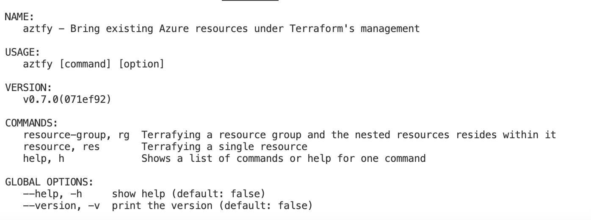

# Azure Terrafy

A tool to bring your existing Azure resources under the management of Terraform.

***How to install terrafy?***


***From Release***

Precompiled binaries and Window MSI are available at Releases.

-From Go toolchain
```
go install github.com/Azure/aztfy@latest
````
From Package Manager:

-Homebrew (Linux/macOS)
```
brew install aztfy
```

-dnf (Linux)

Supported versions:

RHEL 8 (amd64, arm64)
RHEL 9 (amd64, arm64)

Import the Microsoft repository key:
```
rpm --import https://packages.microsoft.com/keys/microsoft.asc
```
Add packages-microsoft-com-prod repository:

**ver=8 # or 9**
```
dnf install -y https://packages.microsoft.com/config/rhel/${ver}/packages-microsoft-prod.rpm
```
Install:
```
dnf install aztfy
```
-apt (Linux)

Supported versions:

Ubuntu 20.04 (amd64, arm64)
Ubuntu 22.04 (amd64, arm64)
Import the Microsoft repository key:
```
curl -sSL https://packages.microsoft.com/keys/microsoft.asc > /etc/apt/trusted.gpg.d/microsoft.asc
```
Add packages-microsoft-com-prod repository:

**ver=20.04 # or 22.04**
```
apt-add-repository https://packages.microsoft.com/ubuntu/${ver}/prod
```
Install:
```
apt-get install aztfy
```
-AUR (Linux)
```
yay -S aztfy
```
***Precondition***

There is no special precondtion needed for running aztfy, except that you have access to Azure.

Although aztfy depends on terraform, it is not required to have terraform pre-installed and configured in the PATH before running aztfy. aztfy will ensure a terraform in the following order:

 - If there is already a terraform discovered in the PATH whose version >= v0.12, then use it
 - Otherwise, if there is already a terraform installed at the aztfy cache directory, then use it
 - Otherwise, install the latest terraform from Hashicorp's release to the aztfy cache directory

(The aztfy cache directory is at: "<UserCacheDir>/aztfy")

# Azyre terrafy help

To get help please run:
```
aztfy
```
or
```
aztfy help
```
